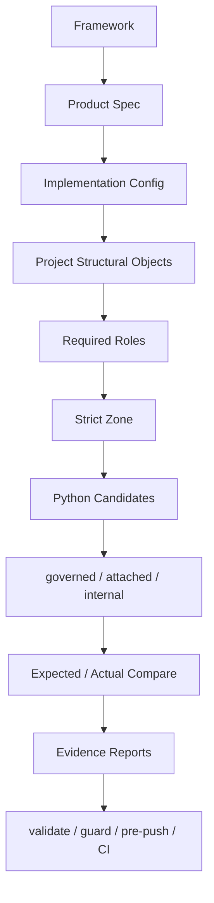
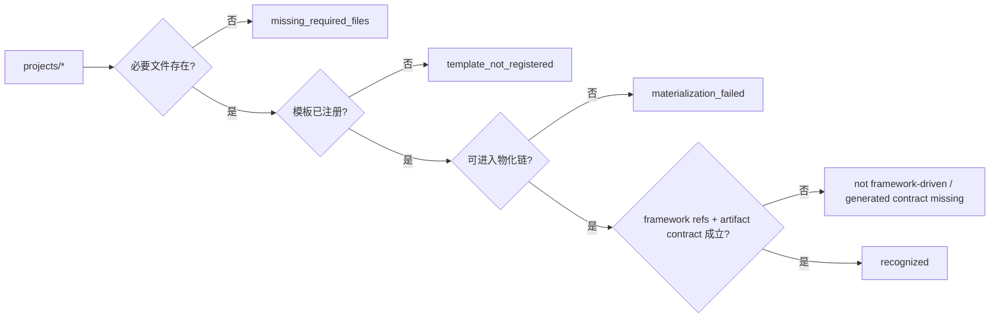
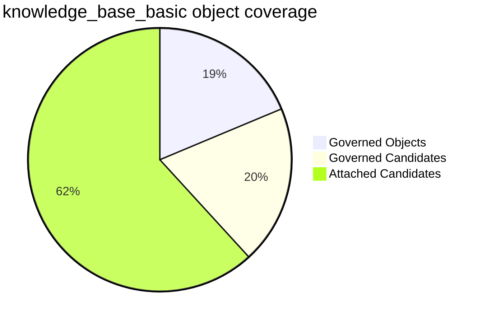

# 第二轮双向治理验真报告

## 1. 总览

这份报告对应第二轮“验真与补强”。目标不是再发明一层治理，而是证明第一轮不是伪泛化。

当前关键证据：

- 工作区治理树：[shelf_governance_tree.html](hierarchy/shelf_governance_tree.html)
- 项目发现审计 JSON：[project_discovery_audit.json](hierarchy/project_discovery_audit.json)
- 项目发现审计说明：[project_discovery_audit.md](project_discovery_audit.md)
- 主链路与覆盖说明：[框架到代码映射与反查覆盖说明.md](框架到代码映射与反查覆盖说明.md)
- strict zone 报告：[strict_zone_report.json](../projects/knowledge_base_basic/generated/strict_zone_report.json)
- 对象覆盖报告：[object_coverage_report.json](../projects/knowledge_base_basic/generated/object_coverage_report.json)
- scanner 规则文档：[python_candidate_scanner_rules.md](python_candidate_scanner_rules.md)

## 2. 当前闭环图

## 3. 项目发现审计

当前扫描的是 `projects/*` 全集，而不是“默认只看 knowledge base”。

### 3.1 结果

| 项目目录 | 结果 | 分类 |
| --- | --- | --- |
| `projects/knowledge_base_basic` | 识别 | `recognized` |

### 3.2 当前结论

- 扫描到的项目目录数：1
- 被识别为框架驱动项目：1
- 被排除：0

### 3.3 审计图

## 4. strict zone 最小性

当前 `knowledge_base_basic` strict zone 文件数：`14`

### 4.1 汇总

| 指标 | 数值 |
| --- | --- |
| `required_count` | `14` |
| `redundant_count` | `0` |
| `uncertain_count` | `0` |

### 4.2 证明方式

每个 strict zone entry 都有：

- `object_ids`
- `role_ids`
- `candidate_ids`
- `reasons`
- `why_required`
- `minimality_status`

结论：

- 当前没有发现可疑冗余 carrier
- 当前范围内，strict zone 已经从“推导结果”进一步变成“可审计最小性结果”

## 5. 结构对象覆盖

### 5.1 当前数量

| 指标 | 数值 |
| --- | --- |
| `governed_object_count` | `23` |
| `fully_closed_object_count` | `23` |
| `partially_closed_object_count` | `0` |
| `governed_candidate_count` | `24` |
| `attached_candidate_count` | `76` |
| `internal_candidate_count` | `0` |

### 5.2 当前未覆盖 future categories

- compiler/evidence builders that are still attached-only
- implementation effect objects are field-level, not sink-level
- schema carriers that are still attached-only

### 5.3 覆盖图

## 6. 反例压力测试

当前已实现并自动化验证的 6 类反例：

| 反例 | 期望失败类别 |
| --- | --- |
| route path / method 漂移 | `EXPECTATION_MISMATCH` |
| response / contract 漂移 | `EXPECTATION_MISMATCH` |
| answer behavior 漂移 | `EXPECTATION_MISMATCH` |
| 新增未绑定高风险 route | `MISSING_BINDING` |
| dead config effect | `DEAD_CONFIG_EFFECT` |
| generated / provenance 漂移 | `STALE_EVIDENCE` |

对应测试：

- [test_governance_counterexamples.py](../tests/test_governance_counterexamples.py)

## 7. scanner 规则透明度

Python scanner 已经不是黑盒。当前文档化并测试化的规则包括：

- route decorator / route builder
- BaseModel / TypedDict / Enum / dataclass
- build / compile / resolve / create / materialize
- behavior orchestrator
- config sink
- evidence builder
- governed / attached / internal 消解

## 8. 当前仍未闭合项

这轮没有隐藏问题，当前还剩这些边界：

1. 当前仓库实际仍只有 1 个成熟框架驱动项目，所以多项目审计能力已经存在，但多项目实证还没有发生。
2. scanner 仍是 Python-only。
3. attached 候选已经全部解释，但并不等于都已经提升成独立 governed object。
4. implementation effect 目前是字段级对象，不是 sink 级对象。

## 9. 结论

第二轮已经把下面这句话推进成可审计事实：

> 当前仓库第一轮 object-first 双向治理并非伪泛化或弱包装：项目发现结果可审计，strict zone 是最小实现闭包而非扩大白名单，结构对象集合有正式覆盖报告，高置信候选不存在未消解漏网项，关键反例会被系统稳定拦住，scanner 规则不再是黑盒。
