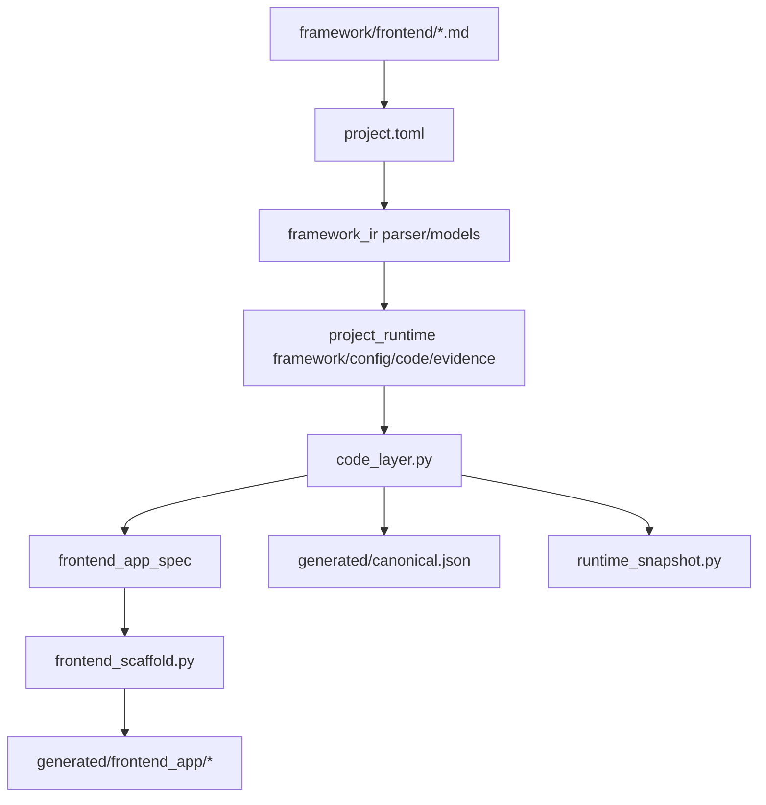
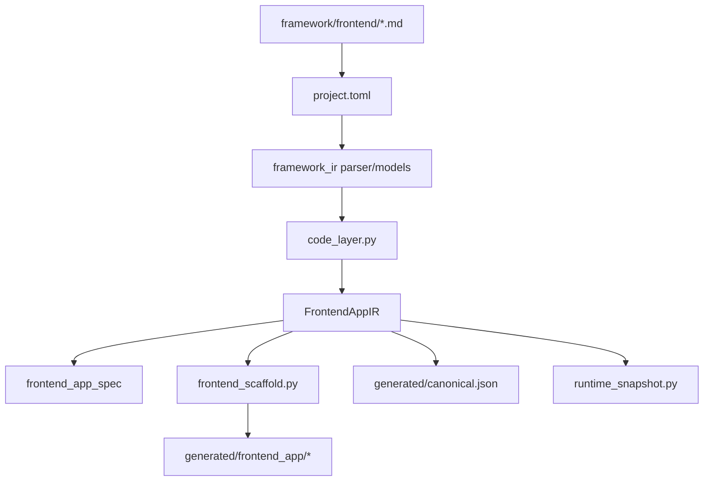

# Frontend 物化流程与 FrontendAppIR 摘要版

## 结论

建议引入 `FrontendAppIR`，并直接切换 frontend 工程收束路径。

原因不是当前链路不能生成 frontend 工程，而是当前链路更适合生成“可运行前端”，尚不适合稳定生成“结构清晰、适合懒加载、适合持续优化”的 frontend 工程。

`FrontendAppIR` 的职责不是新增作者配置入口，而是作为系统内部统一的 frontend 工程级中间表示，承接：

- implementation profile
- shell / visual 结构
- route / page / layout graph
- materialization plan

`project.toml` 仍然是唯一配置入口，`FrontendAppIR` 由 `framework/frontend/*.md` 与 `project.toml` 自动编译得到。

---

## 当前流程

当前流程的主要问题：

- frontend 工程结构判断分散在 `code_layer.py` 与 `frontend_scaffold.py`
- route / page / layout 关系没有统一收束点
- 生成逻辑容易继续演化为模板技巧和隐式分支
- 不利于后续做路由懒加载、首屏资源边界控制与 FCP / LCP 优化

---

## 引入 FrontendAppIR 后的流程

引入后的核心变化：

- `code_layer.py` 先构造 `FrontendAppIR`
- `frontend_app_spec` 从 `FrontendAppIR` 派生
- `frontend_scaffold.py` 基于 `FrontendAppIR` 生成工程文件
- frontend 工程结构不再由多个实现层分散拼装

---

## 为什么值得切换

从最终生成物角度看，引入 `FrontendAppIR` 后更容易稳定获得：

- 清晰的 route / page / layout 边界
- 更合理的 router 文件、page 目录、layout 目录
- 更适合 route-level lazy loading 的工程结构
- 更清晰的首屏 shell 与非首屏页面边界
- 更适合 FCP / LCP 优化与后续 bundle 治理的产物形态

一句话说：

当前流程更偏“实现驱动的拼装”，  
引入 `FrontendAppIR` 后更偏“模型驱动的物化”。

---

## 本次改动范围

本次采用直接切换方案，不保留旧的 frontend 工程收束路径。

本次需要改动的文件只有三类：

1. `src/framework_ir/models.py`
   新增 frontend 工程级 IR 模型，至少包括：
   - `FrontendImplementationProfile`
   - `FrontendShellSpec`
   - `FrontendVisualSpec`
   - `FrontendRouteSpec`
   - `FrontendPageSpec`
   - `FrontendMaterializationPlan`
   - `FrontendAppIR`

2. `src/project_runtime/code_layer.py`
   将 frontend 相关收束逻辑改为：
   - 从 `exact.frontend.*`
   - 从 `exact.code.frontend`
   - 从必要的 domain exact
   统一构造 `FrontendAppIR`

   同时将：
   - `frontend_app_spec`
   - frontend 相关 runtime export
   改为从 `FrontendAppIR` 派生。

3. `src/project_runtime/frontend_scaffold.py`
   改为消费 `FrontendAppIR` 或其直接派生结构生成 frontend 工程文件，移除旧的分散推理逻辑。

联动检查但不作为本次重点改造的文件：

- `src/project_runtime/compiler.py`
- `src/project_runtime/evidence_layer.py`
- `scripts/materialize_project.py`
- `scripts/validate_canonical.py`

---

## 完成标准

本次完成后应满足：

1. `project.toml` 仍是唯一配置入口
2. frontend 工程结构先收束为 `FrontendAppIR`
3. `frontend_app_spec` 从 `FrontendAppIR` 派生
4. `frontend_scaffold.py` 基于 `FrontendAppIR` 生成 frontend 工程
