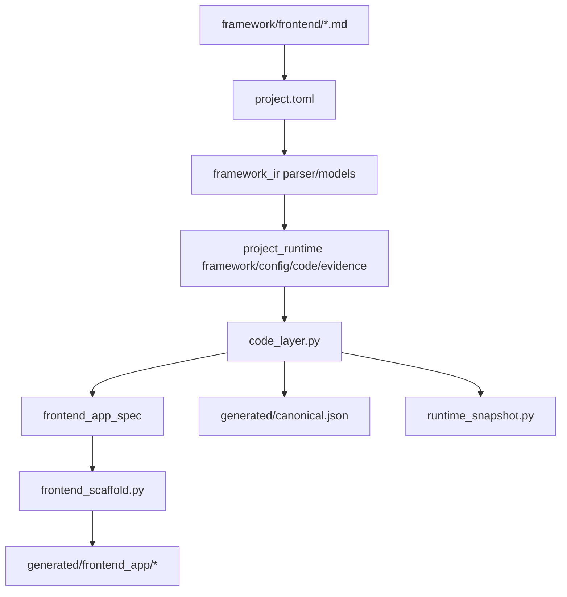
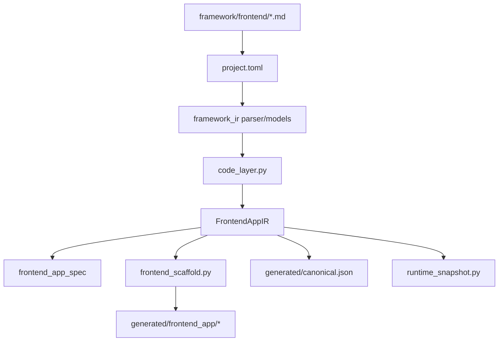

# Frontend 物化流程对比与 FrontendAppIR 引入草案

## 背景

当前仓库已经能够从：

- `framework/frontend/*.md`
- `projects/<project_id>/project.toml`

物化出：

- `generated/canonical.json`
- `generated/runtime_snapshot.py`
- `generated/frontend_app/*`

现阶段的主要问题不是“是否能生成前端工程”，而是 frontend 工程结构尚未形成统一的工程级中间表示，导致工程形态更多由实现层逐步拼装出来，而不是由统一模型稳定派生。

这不仅影响实现边界，也会直接影响最终生成物的质量，例如：

- 路由边界是否清晰
- 是否适合做路由懒加载
- 是否便于控制首屏资源边界
- 是否有利于后续优化 FCP / LCP
- 是否能稳定形成可维护的 page / layout / runtime 结构

本文用于对比：

- 当前物化流程
- 引入 `FrontendAppIR` 之后的物化流程
- 二者对最终生成物质量的影响
- 是否建议引入 `FrontendAppIR`

---

## 1. 范围边界

本文讨论的是 frontend 工程物化流程，不讨论以下事项：

- 不新增第二配置入口，`project.toml` 仍然是唯一项目配置入口
- 不让 `FrontendAppIR` 成为人工维护文件
- 不改变 `framework -> config -> code -> evidence` 的单向收敛关系
- 不将 domain 真相重新下沉到 frontend IR
- 不在本提案中展开具体 React/Vite 模板实现细节
- 不在本提案中直接引入新的并行真相源

换句话说，本提案只讨论：

**是否需要一个系统内部的 frontend 工程级中间表示，用于统一承接 frontend 工程结构。**

---

## 2. 当前物化流程

### 2.1 流程说明

当前 frontend 相关物化链路大致如下：

1. `framework/frontend/*.md`  
   定义 frontend framework 的 capability / boundary / base / rule。

2. `project.toml`  
   作为唯一配置入口，填写：
   - `communication.frontend.*`
   - `exact.frontend.*`
   - `exact.code.frontend`

3. `framework_ir parser/models`  
   解析 framework markdown，形成基础 framework IR。

4. `code_layer.py`  
   基于分散的 frontend 配置编译出：
   - `frontend_app_spec`
   - frontend 相关 runtime export
   - canonical 所需结构

5. `frontend_scaffold.py`  
   基于 `frontend_app_spec` 和 runtime export 生成 `generated/frontend_app/*`

### 2.2 流程图

### 2.3 当前流程的特点

优点：

- `project.toml` 仍然是唯一配置入口
- 主链已经可以运行并生成 frontend 工程
- canonical 与 frontend 产物链路已经打通

限制：

- frontend 工程结构判断分散
- `code_layer.py` 与 `frontend_scaffold.py` 都在参与工程层推理
- route / page / layout / materialization 关系没有统一承接对象
- 生成逻辑容易演化为“模板技巧 + 隐式分支”

---

## 3. 从最终生成物角度看，当前流程的不足

### 3.1 路由边界不够显式

如果 route / page / layout 关系没有统一模型承接，生成器往往只能拼出一个可运行的前端，而不一定能稳定生成一个“页面边界清晰”的前端工程。

这会带来几个问题：

- 页面模块不一定是一等对象
- 路由配置不一定是独立结构
- layout 与 page 可能混在同一个大文件中
- 不利于后续引入嵌套路由和懒加载策略

### 3.2 不利于路由懒加载

如果 route graph 不是统一结构对象，生成器就很难稳定决定：

- 哪些页面应成为独立 chunk
- 哪些 route 可以 lazy import
- 哪些 layout 应当常驻首屏
- 哪些 domain 页面适合延迟加载

结果通常是：

- 单个入口文件过重
- 页面边界模糊
- 后续要加懒加载时需要大量手工改造

### 3.3 不利于首屏性能优化

从 FCP / LCP 角度看，工程生成是否结构化很重要。

如果前端工程的首屏结构不是先在模型层明确下来，就容易出现：

- 首屏加载了过多与当前 route 无关的逻辑
- 运行时数据桥接、页面结构、场景组件一并进入主包
- layout / page / scene 之间缺少合理的加载边界

这会直接影响：

- FCP：首屏可见内容的出现速度
- LCP：首屏主要内容块的可见时间

### 3.4 不利于后续可持续优化

当前流程更像“先生成一个能工作的工程”，但不一定天然适合继续做：

- route-based code splitting
- 资源优先级控制
- 首屏 shell 提前渲染
- 页面级 suspense / lazy boundary
- layout 与 page 分层缓存
- bundle 分析与拆包治理

也就是说，当前流程生成的是“可运行前端”，但未必是“可持续优化前端”。

---

## 4. 如果不引入 FrontendAppIR 的直接后果

如果不引入 `FrontendAppIR`，则 frontend 工程相关判断会继续分散在：

- `project.toml` 的多个 frontend section
- `code_layer.py`
- `frontend_scaffold.py`
- 模板内部隐式规则

这会带来以下直接后果：

- route / page / layout 关系继续被重复推导
- scaffold 分支持续膨胀
- 工程结构真相持续散落在多个实现文件中
- 生成物质量越来越依赖模板实现细节
- 懒加载、首屏优化、chunk 治理缺少稳定结构前提

因此，问题不只是“实现是否优雅”，而是“最终生成物是否具备长期演进的结构基础”。

---

## 5. 引入 FrontendAppIR 后的物化流程

### 5.1 核心思路

引入 `FrontendAppIR` 的目的不是增加新的作者配置入口，而是在系统内部增加一个统一的 frontend 工程级中间表示。

`FrontendAppIR` 应由：

- `framework/frontend/*.md`
- `project.toml`

自动编译得到，并统一承接 frontend 工程相关结构，例如：

- implementation profile
- shell / visual 结构
- page / layout / route graph
- a11y 约束
- materialization plan
- 页面与首屏加载边界

### 5.2 流程图

### 5.3 引入 IR 后的变化

引入 `FrontendAppIR` 后，关键变化在于：

1. `code_layer.py` 不再直接零散拼装 frontend 工程结构
2. 它先将 frontend 相关配置收束为 `FrontendAppIR`
3. 后续派生层统一消费 `FrontendAppIR`
4. `frontend_scaffold.py` 的职责从“翻译 + 部分推理”收缩为“主要翻译”

这样 frontend 工程会先形成统一模型，再进入物化阶段。

---

## 6. 从最终生成物角度看，引入 IR 后的收益

### 6.1 更适合生成真正的 route graph

当 route / page / layout 成为 `FrontendAppIR` 中的一等对象后，生成器可以稳定产出：

- `router.tsx`
- `pages/*`
- `layouts/*`
- route manifest
- return / navigation graph

这意味着生成出来的不只是一个“运行起来的 App”，而是一个结构清晰的 frontend 工程。

### 6.2 更适合路由懒加载

如果 `FrontendAppIR` 中明确存在：

- page spec
- route graph
- layout spec
- materialization plan

那么生成器就可以更自然地支持：

- route-level lazy import
- page chunk 拆分
- layout 常驻、page 按需加载
- 非首屏 route 延迟加载

这会让生成物天然更适合做懒加载，而不是生成后再人工改造。

### 6.3 更有利于 FCP / LCP 优化

`FrontendAppIR` 并不能自动保证性能最好，但它可以让性能优化具备结构前提：

- 首屏 route 与非首屏 route 可区分
- 首屏 shell 与场景页面可区分
- 共享 layout 与页面内容可区分
- 运行时数据桥接与页面渲染边界可区分

有了这些结构边界，后续才更容易做：

- 缩小首屏主包
- 优先加载首屏必要资源
- 延迟加载非首屏页面代码
- 控制大块 UI 逻辑对 LCP 的拖累

### 6.4 更适合长期维护与演进

从长期看，引入 IR 后生成的工程更适合继续扩展：

- 增加新页面
- 引入嵌套路由
- 调整 layout 层级
- 增加页面级 loading / suspense 边界
- 按 route 或按 scene 做 chunk 拆分
- 做 bundle 体积治理与性能追踪

这意味着生成物不仅“能跑”，而且更像一个真正可维护、可优化的 frontend 工程骨架。

---

## 7. 两种流程的核心差异

| 对比项 | 当前流程 | 引入 FrontendAppIR 后 |
|---|---|---|
| 配置入口 | `project.toml` | `project.toml` |
| 是否新增人工配置 | 否 | 否 |
| 是否有统一前端工程对象 | 否 | 是 |
| 工程结构判断位置 | 分散 | 收束 |
| scaffold 职责 | 翻译 + 推理 | 主要翻译 |
| route / page / layout 是否是一等结构 | 不稳定 | 更稳定 |
| 是否天然适合路由懒加载 | 较弱 | 更强 |
| 是否有利于 FCP / LCP 优化 | 较弱 | 更强 |
| 扩展复杂能力的方式 | 容易增加 if/else 与模板分支 | 先扩 IR，再扩生成逻辑 |
| 验证重点 | 结果正确性 | IR 完整性 + 结果正确性 |

---

## 8. 本次改动范围

本次采用直接切换方案，不保留旧的 frontend 工程收束路径。

目标只有一个：

**将 frontend 物化流程切换为：先构造 `FrontendAppIR`，再由 `FrontendAppIR` 统一派生 frontend 相关产物。**

### 8.1 本次需要改动的文件

1. `src/framework_ir/models.py`  
   新增 frontend 工程级 IR 模型，至少包括：

   - `FrontendImplementationProfile`  
     表达前端实现技术栈与实现 profile，例如 framework、bundler、language、styling、package manager 等。

   - `FrontendShellSpec`  
     表达前端工程的根壳层结构，例如 shell 类型、layout 变体、主要 surface region 等。

   - `FrontendVisualSpec`  
     表达前端工程的视觉基础配置，例如品牌、accent、surface preset、radius、shadow、font scale 等。

   - `FrontendRouteSpec`  
     表达单条 route 的结构信息，例如 route id、path、关联 page、返回目标等。

   - `FrontendPageSpec`  
     表达页面级结构信息，例如 page id、页面承载区域、关联 layout、与 route 的映射关系等。

   - `FrontendMaterializationPlan`  
     表达 frontend 工程物化计划，例如需要生成哪些目录、入口文件、router 文件、page/layout 目录及基础依赖集合。

   - `FrontendAppIR`  
     作为 frontend 工程的统一中间表示，收束 implementation、shell、visual、route、page 与 materialization 信息，作为后续 frontend 派生产物的唯一内部来源。

2. `src/project_runtime/code_layer.py`  
   将 frontend 相关收束逻辑改为：

   - 从 `exact.frontend.*`
   - 从 `exact.code.frontend`
   - 从必要的 domain exact  
     统一构造 `FrontendAppIR`

   同时将：

   - `frontend_app_spec`
   - frontend 相关 runtime export

   改为从 `FrontendAppIR` 派生。

3. `src/project_runtime/frontend_scaffold.py`  
   改为消费 `FrontendAppIR` 或其直接派生结构生成 frontend 工程文件，移除旧的分散推理逻辑。

### 8.2 本次可能需要联动检查的文件

1. `src/project_runtime/compiler.py`  
   如果 runtime snapshot 或编译输出依赖 frontend 收束结构，需要同步调整。

2. `src/project_runtime/evidence_layer.py`  
   如果 canonical / evidence 视图直接依赖旧的 frontend 生成结构，需要同步调整为从新链路派生。

3. `scripts/materialize_project.py`  
   一般不需要改逻辑，但需要验证新链路下物化是否正常。

4. `scripts/validate_canonical.py`  
   如果 frontend 相关 canonical 结构发生变化，需要同步校验规则。

### 8.3 本次不作为重点改动的文件

本次不以修改以下文件为重点：

- `project.toml`
- `framework/frontend/*.md`
- `src/framework_ir/parser.py`
- frontend 样式或页面模板细节
- 懒加载 / chunk / FCP / LCP 优化策略本身

这些内容如无必要，不在本次改动范围内扩散。

### 8.4 本次完成标准

本次完成后应满足：

1. `project.toml` 仍是唯一配置入口
2. frontend 工程结构先收束为 `FrontendAppIR`
3. `frontend_app_spec` 从 `FrontendAppIR` 派生
4. `frontend_scaffold.py` 基于 `FrontendAppIR` 生成 frontend 工程
5. 旧的 frontend 分散收束路径不再保留

---

## 9. 最终生成物质量标准

如果引入 `FrontendAppIR`，建议后续用以下标准评估生成物质量：

- 是否具备清晰的 route / page / layout 边界
- 是否可以稳定生成独立 router 文件
- 是否可以支持 route-level lazy loading
- 是否能区分首屏 shell 与非首屏页面代码
- 是否能为 FCP / LCP 优化提供结构前提
- 是否便于做 bundle 分析与拆包治理
- 是否仍然保持 generated frontend 工程为派生物，而非第二真相源

---

## 10. 建议结论

建议引入 `FrontendAppIR`。

原因不是当前流程不能工作，而是：

- 当前流程更适合生成“可运行前端”
- 引入 `FrontendAppIR` 后，更有机会稳定生成“结构清晰、适合懒加载、适合持续优化的 frontend 工程”

本次建议直接切换 frontend 收束路径：

- 由 `FrontendAppIR` 成为 frontend 工程的唯一内部收束点
- `frontend_app_spec`、canonical 视图、scaffold 产物统一从 `FrontendAppIR` 派生

---

## 11. 结论

当前流程更像：

- 配置驱动
- 多层实现共同拼装 frontend 工程
- 生成“可运行前端”

引入 `FrontendAppIR` 后会变成：

- 配置驱动
- 先收束为统一 frontend 工程中间表示
- 再由各派生层稳定物化
- 生成“结构更清晰、更适合懒加载和性能优化的 frontend 工程”

也就是从：

“实现驱动的拼装流程”

走向：

“模型驱动的 frontend 工程物化流程”
