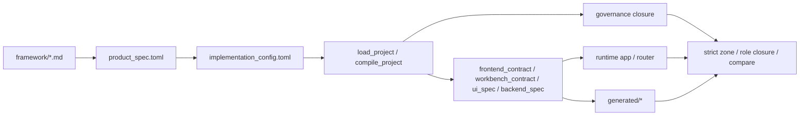

# 从 Framework 到 Code 的主链路与覆盖说明

## 1. 先给结论

当前仓库已经能把 `Framework -> Product Spec -> Implementation Config -> Code -> Evidence` 这条主链路真正跑通，而且不是停留在文档口号层。

更准确地说：

- 对**框架驱动项目的主链路代码**，当前已经建立了从上到下的收敛路径。
- 对**主链路中的高风险结构对象**，当前也已经建立了从下到上的反查校验。
- 当前还**没有**做到“仓库全部代码都能逐行反查回 framework”。

所以最准确的一句话是：

> 当前 `shelf` 已经能覆盖“框架驱动项目的主链路代码”，但还没有覆盖“仓库里的全部实现细节”。

---

## 2. 什么叫“主链路”

这里必须先把“主链路”说清楚，否则“覆盖主链路”会变成空话。

当前仓库里，一个框架驱动项目的**主链路**是指：

> 那些直接承担“把上游结构真相收敛成运行时代码和证据”，以及“把运行时代码反查回上游结构”的代码路径。

也就是说，主链路不是“所有会被 import 的文件”，而是下面这几类承载面：

1. **项目发现与模板解析**
2. **产品/实现配置加载**
3. **项目编译与结构收敛**
4. **运行时装配**
5. **证据物化**
6. **治理闭包与反查校验**

用知识库项目来说，当前主链路可以画成：

---

## 3. 当前主链路具体落在哪些代码

当前以 `projects/knowledge_base_basic/` 为例，主链路上的关键文件是这些。

### 3.1 项目发现与模板解析

- [template_registry.py](/home/xue/code/shelf/src/project_runtime/template_registry.py)
- [project_governance.py](/home/xue/code/shelf/src/project_runtime/project_governance.py)
- [materialize_project.py](/home/xue/code/shelf/scripts/materialize_project.py)

它们负责：

- 自动发现 `projects/<project_id>/`
- 根据 `project.template` 解析模板
- 把项目送入统一物化链

### 3.2 项目加载与编译

- [knowledge_base.py](/home/xue/code/shelf/src/project_runtime/knowledge_base.py)

这里是当前知识库模板的核心编译器。主链路上的关键函数包括：

- `load_knowledge_base_project()`
- `_compile_project()`
- `_build_backend_spec()`
- `_build_ui_spec()`
- `build_implementation_effect_manifest()`
- `materialize_knowledge_base_project()`

它负责把：

- `framework/*.md`
- `product_spec.toml`
- `implementation_config.toml`

收敛成：

- `frontend_contract`
- `workbench_contract`
- `ui_spec`
- `backend_spec`
- `generated_artifacts`

### 3.3 运行时装配

- [app.py](/home/xue/code/shelf/src/knowledge_base_runtime/app.py)
- [backend.py](/home/xue/code/shelf/src/knowledge_base_runtime/backend.py)

它们负责：

- 页面路由注册
- API 路由注册
- 运行时消费编译后的 `backend_spec / ui_spec / route / product truth`

这部分是“Code 层真正暴露给用户和接口”的主承载面。

### 3.4 证据物化

仍然主要在 [knowledge_base.py](/home/xue/code/shelf/src/project_runtime/knowledge_base.py)：

- `framework_ir.json`
- `product_spec.json`
- `implementation_bundle.py`
- `generation_manifest.json`
- `governance_manifest.json`
- `governance_tree.json`
- `strict_zone_report.json`
- `object_coverage_report.json`

这些文件属于 Evidence 层，不是人工真相源。

### 3.5 治理闭包与反查

- [governance.py](/home/xue/code/shelf/src/project_runtime/governance.py)
- [project_governance.py](/home/xue/code/shelf/src/project_runtime/project_governance.py)
- [validate_strict_mapping.py](/home/xue/code/shelf/scripts/validate_strict_mapping.py)
- [workspace_governance.py](/home/xue/code/shelf/src/workspace_governance.py)

它们负责：

- 构建项目级结构对象闭包
- 推导 required roles
- 推导 strict zone
- 扫描 candidate
- 做 governed / attached / internal 消解
- 做 expected / actual compare
- 做 workspace 级治理树和变更闭包

---

## 4. 现在是怎么从 Framework 一步一步走到 Code 的

这里按真实执行路径梳理，不按概念口号梳理。

### 第 1 步：先发现“哪些项目进入这条链”

入口是 [project_governance.py](/home/xue/code/shelf/src/project_runtime/project_governance.py) 的：

- `discover_framework_driven_projects()`

发现规则是：

1. `projects/<project_id>/product_spec.toml` 存在
2. `implementation_config.toml` 同目录存在
3. `project.template` 可解析
4. 模板已注册
5. 项目能通过注册模板加载
6. 项目能给出 framework refs 与 artifact contract

当前实际发现结果只有一个项目：

- `knowledge_base_basic`

这不是预设，是当前仓库扫描结果。

### 第 2 步：加载 Product Spec 与 Implementation Config

入口是 [knowledge_base.py](/home/xue/code/shelf/src/project_runtime/knowledge_base.py)：

- `_load_product_spec()`
- `_load_implementation_config()`

这里做的是：

- 读取产品真相
- 读取实现细化
- 保持二者职责分离

### 第 3 步：把 Framework + Product + Implementation 编译成项目结构

核心是 [knowledge_base.py](/home/xue/code/shelf/src/project_runtime/knowledge_base.py) 的 `_compile_project()`。

这一步做了三件事：

1. 解析 framework module
2. 验证 product spec 是否仍然落在 framework 边界内
3. 验证 implementation config 是否只是实现细化而不是回改产品真相

然后继续构建：

- `frontend_contract`
- `workbench_contract`
- `ui_spec`
- `backend_spec`

这里已经开始从“上游结构”收敛到“可运行代码所依赖的编译结果”。

### 第 4 步：把编译结果装配成运行时代码

主入口是：

- [app.py](/home/xue/code/shelf/src/knowledge_base_runtime/app.py) 的 `build_knowledge_base_runtime_app()`
- [backend.py](/home/xue/code/shelf/src/knowledge_base_runtime/backend.py) 的 `build_knowledge_base_router()`

运行时代码不是自己再发明结构，而是消费：

- `project.route`
- `backend_spec`
- `ui_spec`
- `frontend_contract`
- `workbench_contract`

也就是说，当前主链路里：

> runtime 是编译结果的消费者，不是新的真相源。

### 第 5 步：把结果物化成 Evidence

入口是 [knowledge_base.py](/home/xue/code/shelf/src/project_runtime/knowledge_base.py) 的：

- `materialize_knowledge_base_project()`

它会把当前项目写成 `generated/*` 下的证据层。

这一步非常关键，因为它保证：

- 代码不是唯一输出
- 治理结果、对象覆盖、strict zone、生成物 provenance 都被物化成可审计产物

---

## 5. 现在是怎么从 Code 反查回 Framework 的

当前反查不是靠“看这次 diff 是否顺手改了上游文件”，而是靠结构对象和语义 compare。

### 5.1 先构建项目治理闭包

入口是 [governance.py](/home/xue/code/shelf/src/project_runtime/governance.py)：

- `build_governance_closure()`

它会产出：

- `structural_objects`
- `required_roles`
- `role_bindings`
- `strict_zone`
- `candidates`
- `evidence_artifacts`

### 5.2 再从上游推 expected semantics

当前上游不是直接拿 framework 文本逐句比代码，而是先经过对象模型：

- framework-derived
- product-instantiated
- implementation-refined

再给每个结构对象构造：

- `expected_evidence`
- `expected_fingerprint`

### 5.3 再从实现与运行时提 actual semantics

actual semantics 当前主要来自：

- route 实际注册结果
- router 实际 contract
- answer behavior 实际返回行为
- implementation effect 实际下游 sink
- generated evidence 实际内容

### 5.4 最后 compare

主入口仍然是：

- [validate_strict_mapping.py](/home/xue/code/shelf/scripts/validate_strict_mapping.py)

不是另起平行 CLI。

它会做：

1. 标准闭包校验
2. 项目治理闭包校验
3. strict zone / role closure 校验
4. expected / actual compare
5. generated evidence 一致性校验

---

## 6. 当前“主链路代码”具体包括哪些

如果按“直接承担收敛与反查”的标准，当前知识库项目的主链路代码可以分成三层。

### 6.1 上游编译主链

- [template_registry.py](/home/xue/code/shelf/src/project_runtime/template_registry.py)
- [project_governance.py](/home/xue/code/shelf/src/project_runtime/project_governance.py)
- [knowledge_base.py](/home/xue/code/shelf/src/project_runtime/knowledge_base.py)
- [materialize_project.py](/home/xue/code/shelf/scripts/materialize_project.py)

### 6.2 运行时暴露主链

- [app.py](/home/xue/code/shelf/src/knowledge_base_runtime/app.py)
- [backend.py](/home/xue/code/shelf/src/knowledge_base_runtime/backend.py)
- [contracts.py](/home/xue/code/shelf/src/frontend_kernel/contracts.py)
- [workbench.py](/home/xue/code/shelf/src/knowledge_base_framework/workbench.py)

### 6.3 反查与治理主链

- [governance.py](/home/xue/code/shelf/src/project_runtime/governance.py)
- [validate_strict_mapping.py](/home/xue/code/shelf/scripts/validate_strict_mapping.py)
- [workspace_governance.py](/home/xue/code/shelf/src/workspace_governance.py)

---

## 7. 当前是否已经覆盖主链路代码

答案是：**大体上已经覆盖主链路，但覆盖方式有强弱之分。**

### 7.1 当前强覆盖的主链路代码

这部分一改，当前系统通常会直接报错或比对失败。

#### A. runtime route / API contract

主要是：

- [app.py](/home/xue/code/shelf/src/knowledge_base_runtime/app.py)
- [backend.py](/home/xue/code/shelf/src/knowledge_base_runtime/backend.py)

当前已强覆盖：

- page routes
- library API contracts
- chat API contract
- answer behavior

#### B. 项目编译 surface

主要是：

- [knowledge_base.py](/home/xue/code/shelf/src/project_runtime/knowledge_base.py)

当前已强覆盖：

- `_build_ui_spec()`
- `_build_backend_spec()`
- `build_implementation_effect_manifest()`
- `materialize_knowledge_base_project()`

#### C. generated evidence

当前已强覆盖：

- `framework_ir.json`
- `product_spec.json`
- `implementation_bundle.py`
- `generation_manifest.json`
- `governance_manifest.json`
- `governance_tree.json`
- `strict_zone_report.json`
- `object_coverage_report.json`

#### D. 治理主链本身

主要是：

- [governance.py](/home/xue/code/shelf/src/project_runtime/governance.py)
- [validate_strict_mapping.py](/home/xue/code/shelf/scripts/validate_strict_mapping.py)

这部分现在通过：

- 反例测试
- role closure
- payload rebuild compare

维持自校验。

### 7.2 当前部分覆盖的主链路代码

这部分仍然在主链路上，但当前更多是间接约束，不是逐段强 compare。

- [frontend.py](/home/xue/code/shelf/src/knowledge_base_runtime/frontend.py)
- [frontend_style.py](/home/xue/code/shelf/src/knowledge_base_runtime/frontend_style.py)
- [frontend_script.py](/home/xue/code/shelf/src/knowledge_base_runtime/frontend_script.py)

这些文件当前会通过：

- `ui_spec`
- surface contract
- route 结果
- object / role closure

被间接约束。

但这还不等于：

- 每一段 HTML 片段
- 每一段样式 token 组合
- 每一段浏览器 helper

都已经有独立的 framework 反查 compare。

### 7.3 当前不属于主链路或尚未强治理的代码

例如：

- 低风险 helper
- 普通工具函数
- 一些内部转换函数
- 低风险展示细节

它们可能在 strict zone 外，也可能在 strict zone 内但只是 `attached/internal`，当前没有被提升成独立 governed object。

---

## 8. 所以，“覆盖主链路”到底是什么意思

当前这个说法如果严谨展开，应该理解成：

> 仓库已经覆盖了“框架驱动项目里，负责把上游结构收敛成运行时与证据、并负责把运行时与证据反查回上游”的那条核心代码路径。

它不等于：

> 仓库里所有代码都已经有一一对应的 framework 依据。

所以回答“现在是否能覆盖主链路的代码”，应分两句：

1. **能覆盖主链路上的关键结构代码。**
2. **还不能覆盖主链路上的全部低层实现细节，更不能覆盖整个仓库的全部代码。**

---

## 9. 当前能力边界

### 已经做到的

- 能从 Framework 一路编译到 Code 和 Evidence
- 能对主链路关键结构做 expected / actual compare
- 能对 implementation_config 的关键 effect 做生效性检查
- 能对 generated evidence 做重生一致性检查
- 能对高风险未绑定结构做拦截

### 还没做到的

- 还没有把主链路上的所有 attached 都提升成 governed object
- 还没有对前端所有细节做独立 compare
- 还没有把 scanner 扩到 Python 之外
- 还没有对多项目集合做实证

---

## 10. 最后一句话

如果问题是：

> 现在仓库能不能把 Framework 一步一步落到代码？

答案是：

> **能，而且当前知识库项目这条链是可运行、可物化、可验证、可反查的。**

如果问题是：

> 现在是否已经覆盖了主链路代码？

答案是：

> **已经覆盖主链路里的关键结构代码，但还没有覆盖主链路里的全部细节代码。**

如果问题是：

> 主链路是什么？

答案是：

> **主链路就是那条直接承担“上游结构收敛到运行时与证据”和“从运行时与证据反查回上游结构”的代码路径。**
