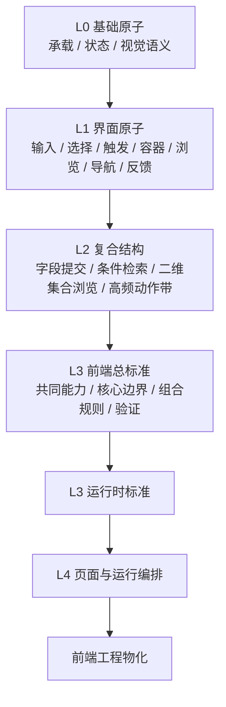
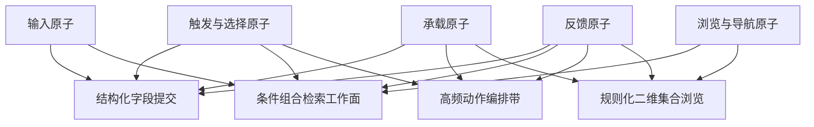
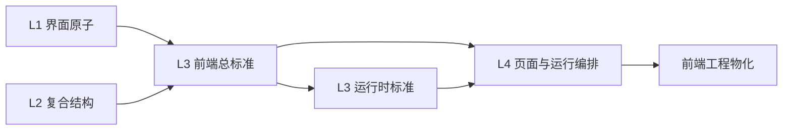

# frontend 框架总览

## 1. 框架是什么

`frontend` 不是某个具体项目的前端模板，也不是某个技术栈脚手架。

它是仓库中的前端共同结构语言，用于回答以下问题：

- 前端系统由哪些稳定结构组成
- 这些结构如何组合才成立
- 哪些差异属于项目实例化，哪些不应突破框架边界
- 页面与工程结构如何从共同结构进一步进入物化

如果用一句话概括：

**frontend 框架通过“原子 -> 复合结构 -> 总标准 -> 页面编排”的方式，把前端收束为可实例化、可验证、可物化的共同结构语言。**

## 2. 框架目标

`frontend` 框架有两项核心目标。

### 2.1 共同结构语言目标

定义跨项目、跨场景、跨实例稳定复用的前端结构语言，包括：

- 承载结构
- 输入结构
- 选择结构
- 触发结构
- 展示结构
- 浏览结构
- 导航结构
- 状态与反馈结构
- 页面与运行编排结构

### 2.2 工程物化承接目标

为页面组织、运行时承接与工程物化提供稳定结构输入，使前端系统能够从共同结构语言进入统一物化链，而不是直接从项目模板或实现技巧出发。

## 3. 总体结构

`frontend` 采用逐层收敛架构：

这条链条的语义如下：

- `L0` 定义最基础的共同结构原子
- `L1` 定义可直接参与界面构造的前端原子
- `L2` 定义由多个原子组合而成的复合结构
- `L3` 将 frontend 共同结构正式收束为标准
- `L4` 定义页面与运行时编排关系
- 最终进入工程物化

## 4. 分层说明

### 4.1 L0：基础原子层

`L0` 定义 frontend 框架内部最基础、最稳定、最可复用的共同结构原子。

当前核心方向包括：

- 承载与绑定
- 状态与交互
- 视觉语义

这一层负责提供最底层结构支撑，不直接面向具体界面控件和复合场景。

其中，`L0-M0-承载与绑定原子模块` 与 `L0-M1-状态与交互原子模块` 可以被理解为 frontend 框架中最接近 headless framework core 的基础层。这里的 “headless” 不主要指“无样式组件”，而是指“先定义结构成立条件，而不预设具体视觉实现”。它们不直接提供具体 UI 组件，而是为更上层的界面原子、复合结构和页面编排提供无外观依赖的基础结构能力。

相应地，`L0-M2-视觉语义原子模块` 可以被理解为 Tailwind CSS 这类原子化样式系统的上游语义承接层。它不直接定义具体 class，也不绑定某一套前端样式技术，而是先定义颜色、间距、字号、圆角、阴影等视觉语义如何成立；后续工程实现中，这些视觉语义可以进一步映射为 Tailwind token、utility class 或设计系统配方。

### 4.2 L1：界面原子层

`L1` 在 `L0` 基础上定义可直接参与界面构造的前端原子模块。

这一层解决的是：值如何进入系统，入口如何发起动作，内容如何被承载，对象如何被浏览，状态如何被附着表达。

#### 输入原子

- `L1-M0` 输入-文本输入-原子模块
  模块短标签：连续文本编辑
  典型落地对象：`input / textarea / inline text editor`
- `L1-M1` 输入-离散值选择-原子模块
  模块短标签：值选择
  典型落地对象：`radio group / checkbox group / switch / slider / stepper / rating`
  典型复用场景：布尔设置、枚举选择、评分录入、范围步进、轻量参数选择
- `L1-M2` 输入-日期时间输入-原子模块
  模块短标签：时间值输入
  典型落地对象：`date picker / time picker / range picker / datetime input`
  典型复用场景：筛选时间、计划时间、预约时间、范围时间输入
- `L1-M3` 输入-文件摄取-原子模块
  模块短标签：文件接纳
  典型落地对象：`upload input / dropzone / intake queue`
  典型复用场景：附件上传、资源导入、资产接纳、工作台侧文件摄取区

#### 触发与选择原子

- `L1-M4` 动作-触发-原子模块
  模块短标签：动作入口
  典型落地对象：`button / icon action / submit trigger / confirm trigger`
- `L1-M5` 选择-临时展开选择面-原子模块
  模块短标签：选择闭合面
  典型落地对象：`dropdown / menu / select panel / temporary option surface`
- `L1-M6` 切换-互斥视图切换-原子模块
  模块短标签：互斥切换
  典型落地对象：`tabs / segmented control / view switcher`
- `L1-M7` 披露-展开披露-原子模块
  模块短标签：展开披露
  典型落地对象：`accordion / disclosure / collapsible section`
- `L1-M8` 提示-锚点附着提示-原子模块
  模块短标签：附着提示
  典型落地对象：`tooltip / popover hint / annotation bubble`

#### 承载原子

- `L1-M9` 承载-展示与容器-原子模块
  模块短标签：展示承载
  典型落地对象：`panel / drawer shell / content surface / reading viewport`
- `L1-M10` 承载-局部任务接管容器-原子模块
  模块短标签：任务接管
  典型落地对象：`dialog / modal / side sheet / confirm surface`
  典型复用场景：确认框、表单任务面、侧滑任务面
- `L1-M11` 承载-媒体预览-原子模块
  模块短标签：媒体预览
  典型落地对象：`image preview / video preview / audio preview / document page preview`
  典型复用场景：图片预览、视频预览、音频预览、文档页预览、资源缩略预览

#### 浏览与导航原子

- `L1-M12` 浏览-集合浏览-原子模块
  模块短标签：集合内浏览
  典型落地对象：`list / tree / item browser / side collection`
- `L1-M13` 导航-路径链导航-原子模块
  模块短标签：路径回溯
  典型落地对象：`breadcrumb / path chain / hierarchical backtrack`
- `L1-M14` 导航-页序列导航-原子模块
  模块短标签：页窗导航
  典型落地对象：`pagination / page window / page jumper`

#### 反馈原子

- `L1-M15` 反馈-标记与反馈-原子模块
  模块短标签：附着反馈
  典型落地对象：`badge / tag / inline status / empty hint / alert bubble`

### 4.3 L2：复合结构层

`L2` 负责将多个 `L1` 原子组合为更高层、可直接复用的前端复合结构。

这一层解决的是：如何从单个界面原子，进一步形成稳定的提交面、检索面、二维浏览面和动作编排带。

- `L2-M0` 提交流-结构化字段提交-标准模块
  典型复用场景：设置面板、创建表单、编辑工作面、局部配置提交面
- `L2-M1` 检索场景-条件组合检索工作面-标准模块
  典型复用场景：列表检索页、管理后台筛选面、知识检索工作面
- `L2-M2` 浏览场景-规则化二维集合浏览-标准模块
  典型复用场景：管理后台、审阅工作台、对比浏览面、结构化列表工作面
  验证中明确的复用场景：管理后台数据表、审阅工作台列表面、二维对比浏览面
- `L2-M3` 动作场景-高频动作编排带-标准模块
  典型复用场景：工作台头部、列表工具栏、上下文操作区
  验证中明确的复用场景：工作台工具栏、列表动作带、上下文命令栏

### 4.4 L3：总标准层

`L3` 是 frontend 框架的核心标准层。

它负责定义：

- 前端共同能力
- 前端核心边界
- 最小可行基
- 组合规则
- 验证方式

这一层的核心任务，是正式回答什么样的前端结构才算成立。

### 4.5 L4：页面与运行编排层

`L4` 负责页面与运行时的组织关系。

它主要回答：

- 页面如何组成页面集
- 页面入口和返回关系如何成立
- 页面如何装入已成立运行时承接面

这一层已经接近工程结构，但仍然属于共同结构标准，而不是项目实例代码本身。

## 5. 模块收敛关系

### 5.1 从 L1 到 L2 的简版收敛关系

这张图表示：

- 输入原子主要进入“提交”和“检索”
- 浏览与导航原子主要进入“检索”和“二维浏览”
- 承载原子主要进入“提交”“二维浏览”“动作带”
- 反馈原子贯穿主要复合结构
- 触发与选择原子是复合结构的重要连接件

### 5.2 从 L2 到 L3/L4 的简版收敛关系

这张图表示：

- `L3` 不只是消费 `L2`，也直接收束部分 `L1`
- `L4` 建立在总标准和运行时标准之上
- 页面编排不是直接从原子拼出来，而是建立在已经成立的 frontend 标准之上

## 6. 核心边界

在当前前端总标准中，核心边界包括以下几类。

### `SURFACE`
界面承载边界。  
决定内容挂在哪里，以及主承载面和辅助承载面如何区分。

### `VISUAL`
视觉语义边界。  
决定视觉差异如何被结构化表达。

### `INTERACT`
交互边界。  
决定输入、选择、切换、展开、创建、删除、提交等交互出口如何成立。

### `STATE`
状态边界。  
决定加载、空态、错误、成功等状态如何统一表达。

### `EXTEND`
扩展边界。  
决定领域框架如何扩展 frontend，而不是重写 frontend。

### `ROUTE`
路由边界。  
决定页面如何进入导航结构，以及入口、返回路径和深链落点如何成立。

### `A11Y`
可访问边界。  
决定结构如何对阅读顺序、键盘导航和辅助技术保持可感知。

## 7. 框架作用

基于当前仓库，frontend 框架的实际作用主要包括：

1. 为前端建立统一共同结构语言
2. 为上层领域框架提供稳定承接面
3. 为项目实例化提供边界
4. 为页面与工程物化提供正式结构输入

## 8. 总结

frontend 框架的本质，不是某个具体前端模板，而是前端共同结构语言。

它通过 `L0 -> L1 -> L2 -> L3 -> L4` 的逐层收敛方式，定义前端原子、复合结构、总标准与页面编排，并为后续页面组织、运行时承接和工程物化提供结构基础。
