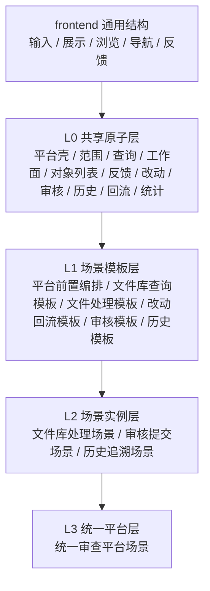
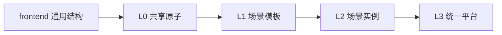
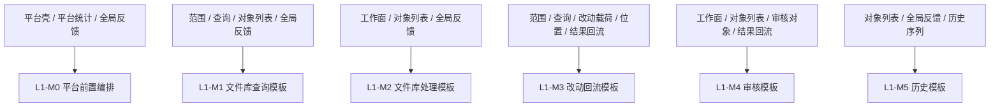
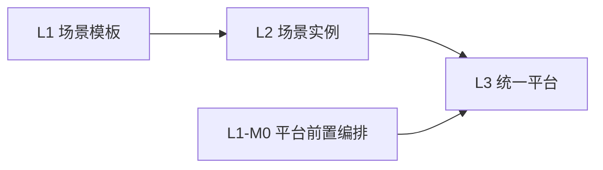

# review_workbench 框架总览

## 1. 框架是什么

`review_workbench` 不是某个具体项目里的单一审查页面，也不是某个处理工作台模板。

它是一个统一审查平台的领域框架，在 frontend 通用结构之上，定义：

- 共享原子
- 场景模板
- 场景实例
- 统一平台

如果用一句话概括：

**review_workbench 通过“共享原子 -> 场景模板 -> 场景实例 -> 统一平台”的方式，把审查平台从页面集合收束成可复用、可扩展、可物化的共同结构语言。**

## 2. 框架目标

`review_workbench` 当前有两个核心目标：

1. 定义统一审查平台的共同结构
   包括平台壳层、场景入口、平台级统计、全局反馈、主工作区与工作面承接。

2. 定义平台内部各类场景模板与场景实例
   包括文件库查询、文件库处理、改动回流、审核提交、历史追溯，以及这些模板如何被场景实例承接。

## 3. 总体结构

`review_workbench` 当前采用逐层收敛结构：

这条链条的语义如下：

- frontend 提供通用前端结构语言
- `L0` 定义 review_workbench 的共享领域原子
- `L1` 定义可跨实例复用的场景模板
- `L2` 定义统一平台内的场景实例
- `L3` 定义统一平台如何承接这些场景实例

## 4. 分层说明

## 4.1 L0：共享原子层

`L0` 负责定义跨多个场景稳定复用的共享结构原子。

这一层主要解决：

- 平台壳层与场景承接如何成立
- 范围上下文如何成立
- 查询条件与筛选上下文如何成立
- 工作集与工作面如何承接
- 对象列表与查看入口如何成立
- 全局反馈与状态提示如何成立
- 文件与目录改动、位置附着与回流如何成立
- 审核对象附着与结论载荷如何成立
- 历史序列与差异承接如何成立
- 结果影响与可观察回流如何成立
- 平台级统计集合如何成立

当前主要模块包括：

- `L0-M0` 统一审查平台壳层与场景承接原子模块
- `L0-M1` 范围上下文与局部摘要原子模块
- `L0-M2` 查询条件与筛选上下文原子模块
- `L0-M3` 工作集与工作面承接原子模块
- `L0-M4` 对象列表与查看入口原子模块
- `L0-M5` 全局反馈与状态提示原子模块
- `L0-M6` 文件与目录改动目标与载荷原子模块
- `L0-M7` 文件与目录位置附着原子模块
- `L0-M8` 审核对象附着与结论载荷原子模块
- `L0-M9` 历史序列与差异承接原子模块
- `L0-M10` 结果影响与可观察回流原子模块
- `L0-M11` 平台级统计集合承接原子模块

这一层的特点是：

1. 面向多个场景复用
2. 默认是前端领域真相源
3. 不直接承担后端契约字段真相
4. 不直接承担场景实例的完整主线

## 4.2 L1：场景模板层

`L1` 负责定义一类场景如何由 `L0` 共享原子稳定组合成场景模板。

这一层主要解决：

- 平台前置编排如何把当前场景挂接到统一平台中
- 文件库查询模板如何成立
- 文件库处理与来源回看模板如何成立
- 文件与目录改动回流支路如何成立
- 审核提交模板如何成立
- 历史追溯模板如何成立

当前主要模块包括：

- `L1-M0` 平台导航到场景挂接编排模块
- `L1-M1` 文件库查询与清单编排模块
- `L1-M2` 文件库处理与来源回看编排模块
- `L1-M3` 文件库范围改动回流编排模块
- `L1-M4` 审核工作栏与结论回流编排模块
- `L1-M5` 历史追溯编排模块

这一层的特点是：

1. `L1` 是模板层，不是场景实例层
2. `L1` 定义一类场景模板如何成立
3. `L1` 可以组合 `L0` 原子与外部后端契约
4. `L1` 不应默认把另一条 `L1` 当作自己的承接结果

## 4.3 L2：场景实例层

`L2` 负责定义统一平台中的场景实例如何承接对应场景模板。

这一层主要解决：

- 统一平台中具体有哪些场景
- 每个场景实例如何进入统一平台
- 每个场景实例如何承接已经成立的场景模板

当前主要模块包括：

- `L2-M0` 文件库处理场景模块
- `L2-M1` 审核提交场景模块
- `L2-M2` 历史追溯场景模块

这一层的特点是：

1. `L2` 是场景实例层
2. `L2` 不重新定义场景模板
3. `L2` 不负责定义统一平台本身
4. `L2` 主要负责场景实例如何挂接到统一平台中

## 4.4 L3：统一平台层

`L3` 负责定义统一平台本身如何成立，以及如何承接 `L2` 场景实例。

这一层主要解决：

- 统一平台如何承接合法场景集合
- 当前场景如何以唯一归属被挂接到统一承接面
- 平台如何保持平台级上下文，而不吞并场景实例内部主线

当前主要模块包括：

- `L3-M0` 统一审查平台场景模块

这一层的特点是：

1. `L3` 是平台层，不是场景实例层
2. `L3` 负责合法场景实例集合的承接
3. `L3` 不负责重写某个场景实例的内部逻辑

## 5. 模块关系图

## 5.1 总体关系

这条关系可以直接理解为：

- frontend 提供通用前端结构
- `L0` 提供 review_workbench 的共享原子
- `L1` 提供场景模板
- `L2` 提供场景实例
- `L3` 负责统一平台承接

## 5.2 L0 到 L1 的关系

这张图说明的重点是：

- 哪些共享原子组合成了哪类场景模板
- 每类场景模板主要依赖哪些共享结构
- `L1` 模板不是凭空出现，而是由 `L0` 共享原子稳定收束出来

## 5.3 L1 到 L2/L3 的关系

这张图说明的重点是：

- `L1` 提供场景模板
- `L2` 提供场景实例
- `L3` 把这些场景统一挂接到平台中
- `L1-M0` 直接参与平台前置承接

## 6. 核心边界

从当前框架看，`review_workbench` 最核心的边界包括：

1. **平台边界**

   

     <table style="width: 100%; min-width: 100%; display: table; table-layout: fixed; border-collapse: collapse;">
       <colgroup>
         <col style="width: 96px;" />
         <col />
       </colgroup>
       <tr><th>项目</th><th>说明</th></tr>
       <tr><td>直观理解</td><td>管“统一平台本身怎么长期成立”。</td></tr>
       <tr><td>关键词</td><td>平台壳、场景入口、顶部工具位、平台级统计、主工作区。</td></tr>
       <tr><td>典型问题</td><td>这是统一平台级结构，还是某个场景自己的局部结构？</td></tr>
     </table>
   

2. **范围边界**

   

     <table style="width: 100%; min-width: 100%; display: table; table-layout: fixed; border-collapse: collapse;">
       <colgroup>
         <col style="width: 96px;" />
         <col />
       </colgroup>
       <tr><th>项目</th><th>说明</th></tr>
       <tr><td>直观理解</td><td>管“当前工作范围是什么，以及怎么切换范围”。</td></tr>
       <tr><td>关键词</td><td>当前范围、范围节点、范围切换、范围展示。</td></tr>
       <tr><td>典型问题</td><td>现在变化的是工作范围，还是范围内的查询条件？</td></tr>
     </table>
   

3. **查询边界**

   

     <table style="width: 100%; min-width: 100%; display: table; table-layout: fixed; border-collapse: collapse;">
       <colgroup>
         <col style="width: 96px;" />
         <col />
       </colgroup>
       <tr><th>项目</th><th>说明</th></tr>
       <tr><td>直观理解</td><td>管“在当前范围里怎么查、怎么筛、查完结果怎么回来”。</td></tr>
       <tr><td>关键词</td><td>查询输入、筛选条件、查询摘要、检索状态、结果回流。</td></tr>
       <tr><td>典型问题</td><td>这是查询条件怎么成立的问题，还是查询结果之后怎么处理的问题？</td></tr>
     </table>
   

4. **工作面边界**

   

     <table style="width: 100%; min-width: 100%; display: table; table-layout: fixed; border-collapse: collapse;">
       <colgroup>
         <col style="width: 96px;" />
         <col />
       </colgroup>
       <tr><th>项目</th><th>说明</th></tr>
       <tr><td>直观理解</td><td>管“当前处在哪个处理面里，以及这个处理面怎么复用和返回”。</td></tr>
       <tr><td>关键词</td><td>工作资源集合、当前工作面、工作面身份、复用关系、回退关系。</td></tr>
       <tr><td>典型问题</td><td>现在问题是工作面切换，还是对象结果展示？</td></tr>
     </table>
   

5. **对象边界**

   

     <table style="width: 100%; min-width: 100%; display: table; table-layout: fixed; border-collapse: collapse;">
       <colgroup>
         <col style="width: 96px;" />
         <col />
       </colgroup>
       <tr><th>项目</th><th>说明</th></tr>
       <tr><td>直观理解</td><td>管“结果对象怎么被列出来、标识出来、点进去、继续处理”。</td></tr>
       <tr><td>关键词</td><td>对象集合、主标识、结果角色、动作入口、查看入口。</td></tr>
       <tr><td>典型问题</td><td>这是对象结果怎么被承接的问题，还是对象后续怎么处理的问题？</td></tr>
     </table>
   

6. **改动边界**

   

     <table style="width: 100%; min-width: 100%; display: table; table-layout: fixed; border-collapse: collapse;">
       <colgroup>
         <col style="width: 96px;" />
         <col />
       </colgroup>
       <tr><th>项目</th><th>说明</th></tr>
       <tr><td>直观理解</td><td>管“到底改谁、改到哪、最少要带什么信息”。</td></tr>
       <tr><td>关键词</td><td>改动目标、改动位置、最小载荷、结果影响。</td></tr>
       <tr><td>典型问题</td><td>现在是在定义改动本身，还是定义改动后的影响？</td></tr>
     </table>
   

7. **审核边界**

   

     <table style="width: 100%; min-width: 100%; display: table; table-layout: fixed; border-collapse: collapse;">
       <colgroup>
         <col style="width: 96px;" />
         <col />
       </colgroup>
       <tr><th>项目</th><th>说明</th></tr>
       <tr><td>直观理解</td><td>管“对哪个对象给出什么审核结论，以及结论最少要包含什么”。</td></tr>
       <tr><td>关键词</td><td>审核对象、审核结论类型、最小结论载荷、后续回流。</td></tr>
       <tr><td>典型问题</td><td>这是审核对象与结论如何成立的问题，还是审核完成后如何回流的问题？</td></tr>
     </table>
   

8. **历史边界**

   

     <table style="width: 100%; min-width: 100%; display: table; table-layout: fixed; border-collapse: collapse;">
       <colgroup>
         <col style="width: 96px;" />
         <col />
       </colgroup>
       <tr><th>项目</th><th>说明</th></tr>
       <tr><td>直观理解</td><td>管“过去发生了什么，怎么按历史序列和差异回看”。</td></tr>
       <tr><td>关键词</td><td>历史序列、差异回看、元信息、追溯承接。</td></tr>
       <tr><td>典型问题</td><td>现在要表达的是历史追溯，还是当前对象的处理流程？</td></tr>
     </table>
   

9. **回流边界**

   

     <table style="width: 100%; min-width: 100%; display: table; table-layout: fixed; border-collapse: collapse;">
       <colgroup>
         <col style="width: 96px;" />
         <col />
       </colgroup>
       <tr><th>项目</th><th>说明</th></tr>
       <tr><td>直观理解</td><td>管“动作做完之后，系统和界面会发生什么变化”。</td></tr>
       <tr><td>关键词</td><td>结果影响、焦点结果、可观察回流。</td></tr>
       <tr><td>典型问题</td><td>这是动作定义本身，还是动作完成后的结果表达？</td></tr>
     </table>
   

10. **平台统计边界**

   

     <table style="width: 100%; min-width: 100%; display: table; table-layout: fixed; border-collapse: collapse;">
       <colgroup>
         <col style="width: 96px;" />
         <col />
       </colgroup>
       <tr><th>项目</th><th>说明</th></tr>
       <tr><td>直观理解</td><td>管“哪些统计是整个统一平台长期都要看到的”。</td></tr>
       <tr><td>关键词</td><td>跨场景统计项、统计集合、更新附着关系。</td></tr>
       <tr><td>典型问题</td><td>这是整个平台长期成立的统计，还是某个当前焦点上的局部统计？</td></tr>
     </table>
   

## 7. 默认扩展规则

`review_workbench` 后续扩展时，默认遵循以下优先级。

1. **优先新增 `L2`**
   如果只是统一平台中新增一个同类型场景实例，默认优先新增 `L2`，不优先改 `L1` 或 `L0`。

2. **新的稳定场景类型才新增 `L1`**
   如果新场景无法自然归入现有场景模板，且这种差异会跨实例稳定复用，才考虑新增 `L1`。

3. **新的共享结构原子才新增 `L0`**
   如果多个 `L1` 模板都开始重复依赖某个新的共享结构，而现有 `L0` 无法表达，才考虑新增或重构 `L0`。

## 8. 修改判定规则

后续修改时，默认按以下方式判断。

1. **实例字段变化**
   如果只是新增字段、筛选项、列表列、统计项、审核意见字段或历史展示字段，优先改实例化配置，不优先改 framework。

2. **同类型场景增加**
   如果只是新增一个新的审核场景、历史场景或对象处理场景，优先新增 `L2`。

3. **新场景主线出现**
   如果新场景既不是文件库处理型，也不是审核型，也不是追溯型，而且会稳定复用，则新增 `L1`。

4. **多模板共享缺口出现**
   如果多个 `L1` 模板都开始重复定义新的共享结构，则考虑新增或重构 `L0`。

## 9. 框架作用

基于当前仓库，`review_workbench` 框架的实际作用主要包括：

1. 为统一审查平台建立领域结构语言
2. 为平台内部场景提供共享原子与场景模板
3. 为场景实例提供稳定挂接方式
4. 为后续实例化、工程实现与物化提供结构基础

## 10. 总结

`review_workbench` 的本质，不是某个单一审查页面模板，而是一个“统一平台 + 场景模板 + 场景实例 + 共享原子”的领域框架。

它通过 `L0 -> L1 -> L2 -> L3` 的方式，把审查平台从页面集合收束成可复用、可扩展、可物化的共同结构语言。
