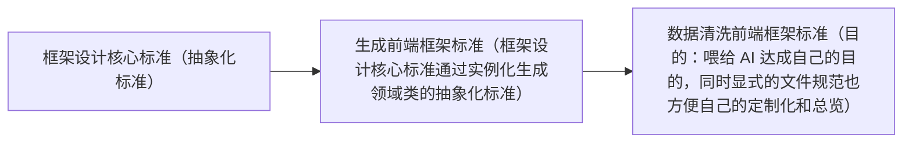

# Framework 前端框架各模块标准的演变

以数据清洗前端框架标准为例，流程如下：

```mermaid
flowchart LR
    A["框架设计核心标准（抽象化标准）"]
    B["生成前端框架标准（框架设计核心标准通过实例化生成领域类的抽象化标准）"]
    C["数据清洗前端框架标准（目的：喂给 AI 达成自己的目的，同时显式的文件规范也方便自己的定制化和总览）"]

    A --> B --> C
```

